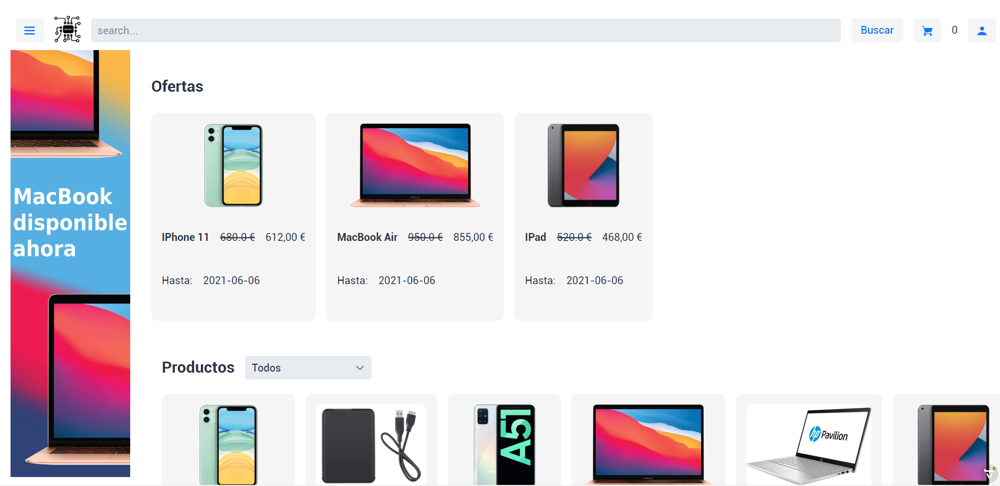
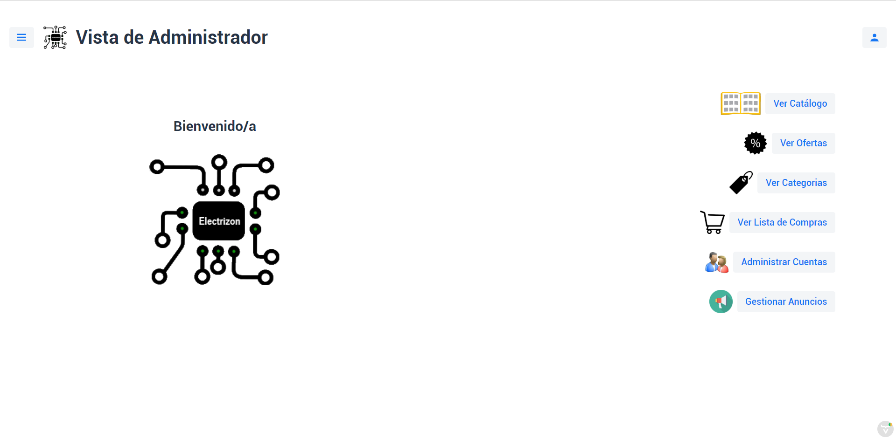
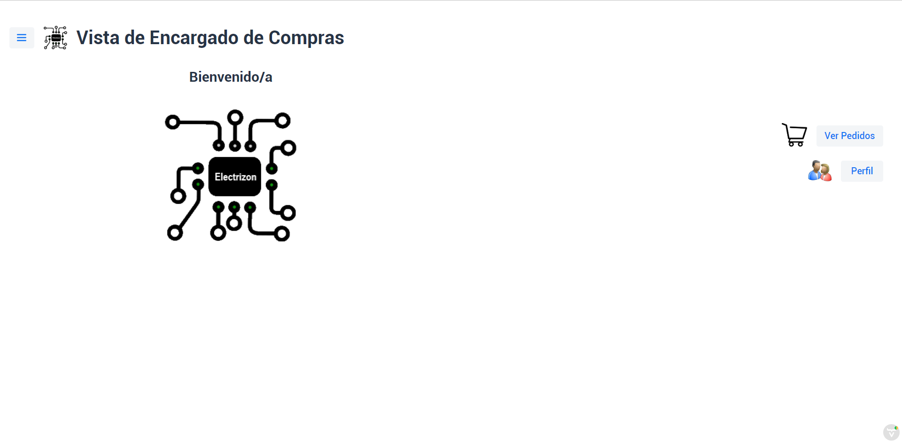
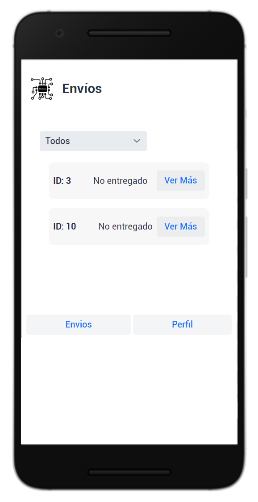

# Modelado y Diseño del Software 2

En esta práctica se desarrolló una tienda virtual y su base de datos usando Vaadin. Existen cinco tipos de usuarios:

- Cibernauta no identificado: puede visualizar el catálogo de la tienda, añadir productos al carrito, iniciar sesión, registrarse y recuperar su contraseña.
- Cibernauta identificado: puede visualizar el catálogo de la tienda, añadir productos al carrito, comprar, visualizar sus pedidos, mandar mensajes a otros cibernautas identificados o al administrador y editar sus datos.

- Administrador: puede crear, editar o eliminar productos, ofertas, categorías, trabajadores (encargados de compras y repartidores) y anuncios. Además, puede editar su perfil y mandar mensajes.

- Encargado de compras: puede marcar algunos pedidos como enviados o pendientes. Además, puede editar su perfil.

- Repartidor: puede marcar algunos pedidos como enviados o entregados. Además, puede editar su perfil.

