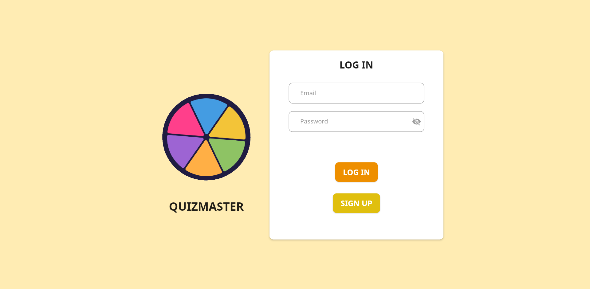
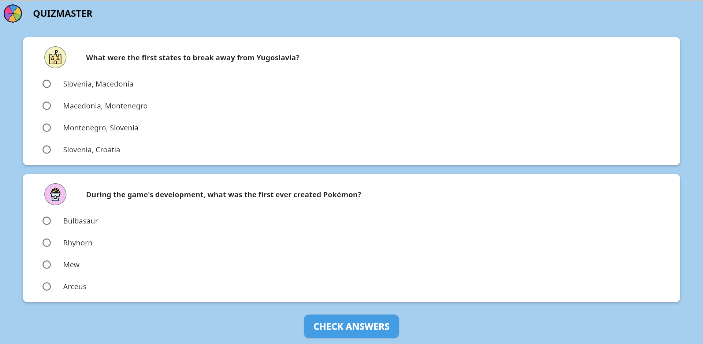
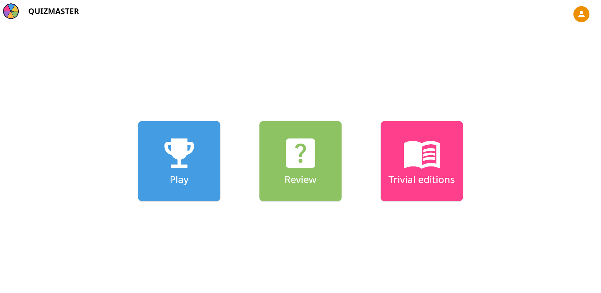

# Quizmaster

En este trabajo se desarrolló una aplicación web de preguntas y respuestas, denominada Quizmaster, utilizando Flutter. Las funciones que puede realizar un usuario son:
- Registrarse o iniciar sesión.

- Jugar una partida, introduciendo el número de preguntas que quiera que le aparezcan. Tras comprobar los resultados podrá guardar algunas de las preguntas para revisarlas más tarde.

- Ver las preguntas que ha guardado y su respuesta correcta.
- Observar un listado con las ediciones actuales de Trivial Pursuit.
- Editar las datos de su perfil.

Las preguntas y respuestas se obtuvieron utilizando la API [Open Trivia](https://opentdb.com/api_config.php). Para obtener las ediciones de Trivial Pursuit se realizó scraping a una página de [Wikipedia](https://en.wikipedia.org/wiki/List_of_Trivial_Pursuit_editions) con un proyecto de Spring Boot y una base de datos postgreSQL creada con Docker. Para guardar los datos de un usuario se utilizó Authentication y Firestore, disponibles en Firebase. También se incluyen los archivos necesarios para dockerizar el proyecto. Finalmente, se utilizó GitHub Actions y GitHub Pages para publicar la aplicación.
