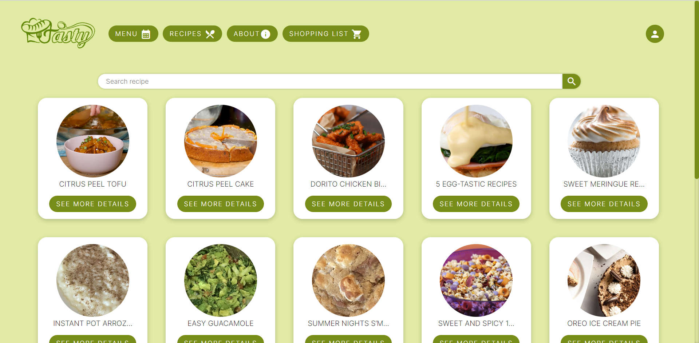

# Tasty

En este proyecto se desarrolló una web de recetas y planificación semanal denominada [Tasty](https://ualdra.github.io/tastydra22/). En ella se pueden ver recetas obtenidas de [Tasty API](https://rapidapi.com/apidojo/api/tasty/), añadirlas a nuestro plan semanal y editar la lista de la compra.

Para su desarrollo se utilizó Angular, Spring Boot (para gestionar la información de la base de datos), Heroku, Docker y GitHub Pages para publicar la web.